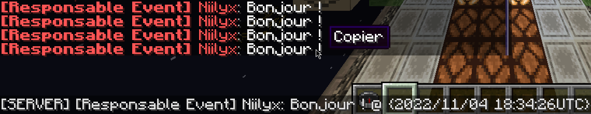

# ECATUP (_Efrei Craft's Awesome Tools and Utilities Plugin_)

## Les commandes et fonctions utiles d'Efrei Craft

### Permissions

| Permission              | Description                                                      |
|-------------------------|------------------------------------------------------------------|
| `ecatup.channel.use`    | Permet au joueur d'utiliser la commande `/channel`.              |
| `ecatup.channel.global` | Permet au joueur d'envoyer des messages dans le canal GLOBAL.    |
| `ecatup.channel.server` | Permet au joueur d'envoyer des messages dans le canal SERVER.    |
| `ecatup.channel.team`   | Permet au joueur d'envoyer des messages dans le canal TEAM.      |
| `ecatup.chat.color`     | Permet au joueur d'envoyer des messages en couleur dans le chat. |
| `ecatup.gamemode`       | Permet au joueur d'utiliser la commande `/gm` et ses dérivées.   |
| `ecatup.give.skull`     | Permet au joueur d'utiliser la commande `/skull`.                |
| `ecatup.lobby`          | Permet au joueur d'utiliser la commande `/lobby`.                |
| `ecatup.slap`           | Permet au joueur d'utiliser la commande `/slap`.                 |
| `ecatup.speed.fly`      | Permet au joueur d'utiliser la commande `/flyspeed`.             |
| `ecatup.speed.reset`    | Permet au joueur d'utiliser la commande `/resetspeed`.           |
| `ecatup.speed.walk`     | Permet au joueur d'utiliser la commande `/walkspeed`.            |
| `ecatup.sudo`           | Permet au joueur d'utiliser la commande `/sudo`.                 |
| `ecatup.whois`          | Permet au joueur d'utiliser la commande `/whois`.                |
| `server.<server_name>`  | Permet au joueur de se connecter au serveur `<server_name>`.     |

### Commandes
| Commande                                                                                                                                                                                        | Description                                                                                                                                              | Alias                        |
|-------------------------------------------------------------------------------------------------------------------------------------------------------------------------------------------------|----------------------------------------------------------------------------------------------------------------------------------------------------------|------------------------------|
| <code>/channel [GLOBAL&#124;SERVER&#124;TEAM]</code>                                                                                                                                            | Bascule sur un canal de chat, ou retourne son canal actuel.                                                                                              | `/chat` `/c`                 |
| <code>/gm <0&#124;1&#124;2&#124;3> [player]</code> <code>/gm <s&#124;c&#124;a&#124;sp> [player]</code> <code>/gm <survival&#124;creative&#124;adventure&#124;spectator> [player]</code> | Change le gamemode de `player`, ou le sien.                                                                                                              | `/gms` `/gmc` `/gma` `/gmsp` |
| `/lobby`                                                                                                                                                                                        | Se ramène au lobby (c'est-à-dire, le serveur s'appelant "lobby").                                                                                        | `/hub` `/spawn`              |
| `/skull [player]`                                                                                                                                                                               | Obtient son propre crâne, ou celui de `player`.                                                                                                          |                              |
| `/slap <player> [-a]`                                                                                                                                                                           | Donne une claque à `player` dans une direction aléatoire (mais vers le haut). Avec -a, `player` sera repoussé dans la direction opposée, à soi-même. | `/bitchslap`                 |
| `/sudo <player> <message&#124;command>`                                                                                                                                                         | Fais dire à quelqu'un quelque chose (un message, ou une commande)                                                                                        |                              |
| `/whois [player]`                                                                                                                                                                               | Obtient des informations sur soi-même, ou `player`. De plus, chaque information est copiable en cliquant dessus.                                         |                              |
|                                                                                                                                                                                                 |                                                                                                                                                          |                              |
| `/flyspeed [[reset&#124;r] OR [-10 - 10]] [player]`                                                                                                                                             | Change sa vitesse de vol, ou celle de `player`                                                                                                           | `/fspeed` `/fsp`             |
| `/walkspeed [[reset&#124;r] OR [-10 - 10]] [player]`                                                                                                                                            | Change sa vitesse de marche, ou celle de `player`                                                                                                        | `/wspeed` `/wsp`             |
| `/resetspeed [player]`                                                                                                                                                                          | Réinitialise sa vitesse, ou celle de `player`                                                                                                            | `/resetsp` `/rspeed` `/rsp`  |

\
\
Chaque message du chat est **copiable** et ajoutera le **canal** sur lequel il a été dit, ainsi que le **timestamp**.
